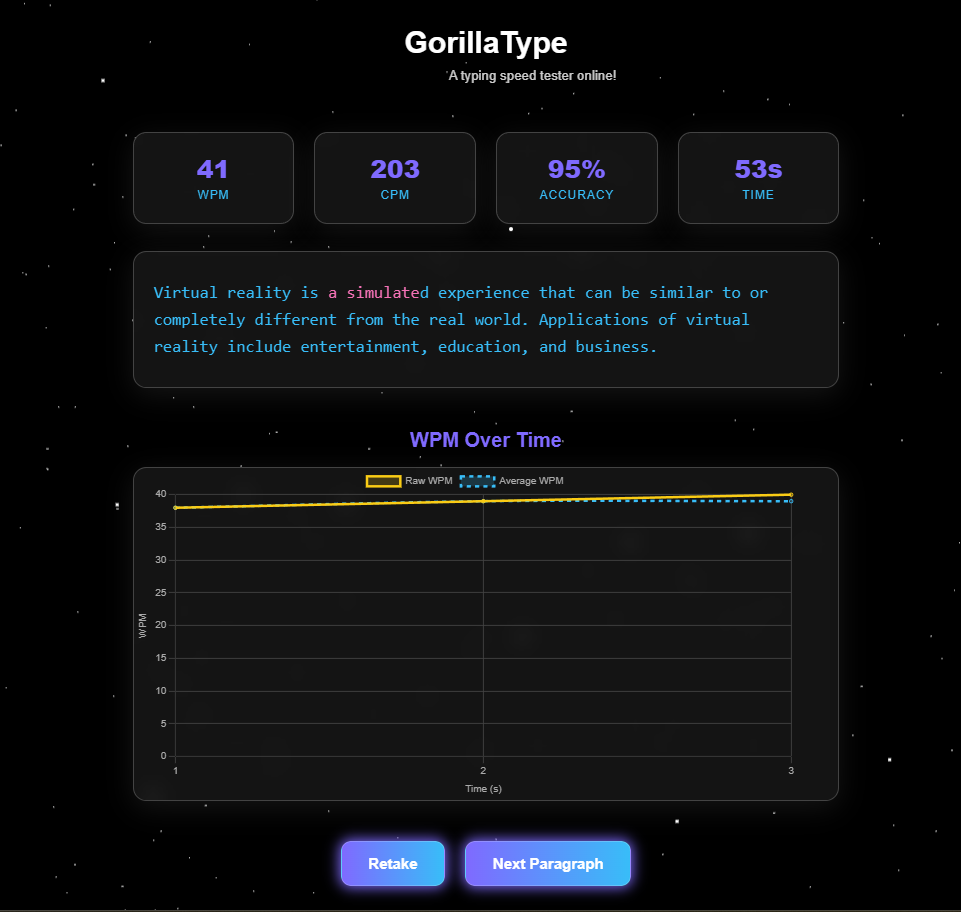

# Typing Speed Test

A modern typing speed test application inspired by Monkeytype, built with Next.js and Tailwind CSS.

## Live Demo

You can try it online at: [https://typing-speed-tester-online.netlify.app/](https://typing-speed-tester-online.netlify.app/)

## Example UI

### Default Theme


### Stars Background Theme



## Features

- Real-time typing speed measurement (WPM and CPM)
- Accuracy tracking
- Timer that starts on first keypress
- Color-coded typing feedback (green for correct, red for incorrect)
- Responsive design
- No backend required - fully static

## Updates

### Latest Features (v2.0)
- **Animated Stars Background**: Toggle between default theme and animated starry background
- **Glass Morphism Effects**: Transparent, glassy UI elements when stars background is active
- **Dynamic Theme Switching**: Seamless transitions between different visual themes
- **Enhanced Visual Feedback**: Improved cursor and character highlighting
- **Background Context Management**: Global state management for background preferences
- **Smooth Animations**: 500ms transitions for all theme changes
- **Stats Display Control**: Statistics only show after test completion for cleaner UI

## Tech Stack

- Next.js
- TypeScript
- Tailwind CSS
- React Hooks

## Getting Started

1. Clone the repository
2. Install dependencies:
   ```bash
   npm install
   ```
3. Run the development server:
   ```bash
   npm run dev
   ```
4. Open [http://localhost:3000](http://localhost:3000) in your browser

## Project Structure

- `/src/app` - Next.js app router pages
- `/src/components` - React components
- `/src/types` - TypeScript type definitions
- `/src/utils` - Utility functions
- `/public` - Static assets and JSON data

## Deployment

Deployed in Netlify

